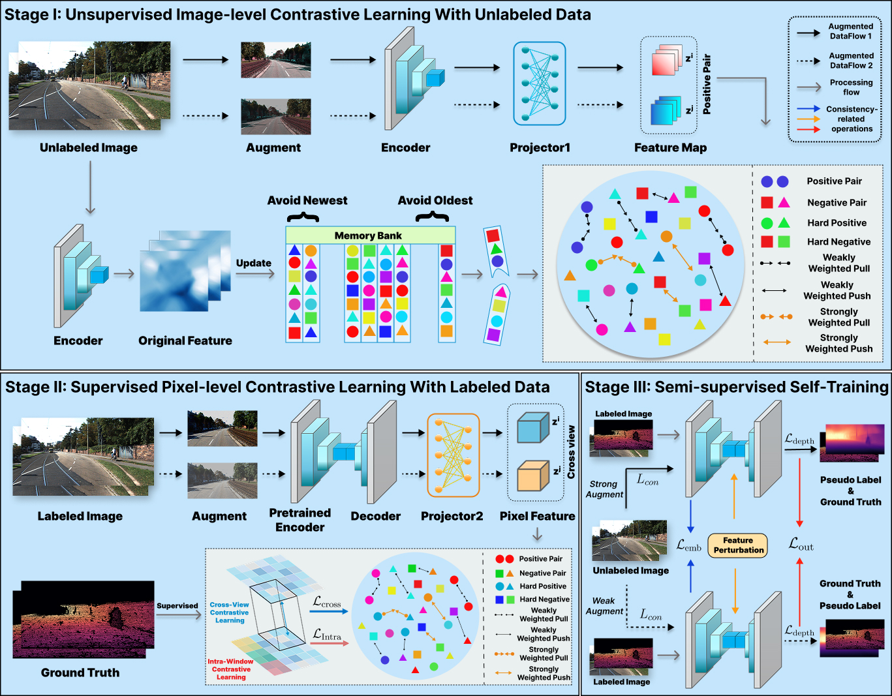

# Leveraging Unlabeled Data via Semi-Supervised Contrastive Learning for Enhanced Monocular Depth Estimation

This repository contains the code implementation for the paper **"Leveraging Unlabeled Data via Semi-Supervised Contrastive Learning for Enhanced Monocular Depth Estimation".**

📄 **[Read the paper here (Pattern Recognition, 2026)]()**



## Installation

```bash
conda create -n TCDepth python=3.10 -y
conda activate TCDepth
pip install -r requirements.txt
```

## Dataset Preparation

This project uses the **KITTI Eigen split** and **NYU Depth V2** datasets. Please download the datasets from the links below and organize them under the `dataset/` directory following the specified structure.

## KITTI Eigen Split

Download:

- [KITTI Raw Data](https://www.cvlibs.net/datasets/kitti/raw_data.php)
- [KITTI Annotated Depth Maps](https://www.cvlibs.net/datasets/kitti/eval_depth_all.php)
- [Required KITTI Raw archives for the Eigen split](https://github.com/cleinc/bts/blob/master/utils/kitti_archives_to_download.txt)

The expected directory structure is:

```text
dataset/
└── kitti_dataset/
    ├── 2011_09_26/
    │   ├── calib_cam_to_cam.txt
    │   ├── calib_imu_to_velo.txt
    │   ├── calib_velo_to_cam.txt
    │   ├── 2011_09_26_drive_0001_sync/
    │   │   ├── image_02/
    │   │   │   └── data/
    │   │   └── image_03/
    │   │       └── data/
    │   └── ...
    ├── 2011_09_28/
    ├── 2011_09_29/
    ├── 2011_09_30/
    ├── 2011_10_03/
    ├── 2011_09_26_drive_0001_sync/
    │   └── proj_depth/
    │       └── groundtruth/
    │           ├── image_02/
    │           └── image_03/
    └── ...
```

## NYU Depth V2

Download:

- [Preprocessed NYU Depth V2 (`sync.zip`)](https://drive.google.com/file/d/1AysroWpfISmm-yRFGBgFTrLy6FjQwvwP/view?usp=sharing)
- [Official NYU Depth V2 website](https://cs.nyu.edu/~silberman/datasets/nyu_depth_v2.html)

> **Note:** This project uses the synchronized preprocessed subset rather than the single-file `nyu_depth_v2_labeled.mat` release.

The expected directory structure is:

```text
dataset/
└── nyu_depth_v2/
    ├── bathroom/
    │   ├── rgb_00045.jpg
    │   ├── sync_depth_00045.png
    │   └── ...
    ├── bedroom_0001/
    │   ├── rgb_00000.jpg
    │   ├── sync_depth_00000.png
    │   └── ...
    ├── kitchen_0001/
    ├── living_room_0001/
    ├── office_0001/
    └── ...
```

## Dataset Layout

After preparation, the project should follow the structure below:

```text
TriConDepth/
├── configs/
├── data_splits/
├── dataset/
│   ├── kitti_dataset/
│   └── nyu_depth_v2/
├── dataloaders/
├── models/
├── networks/
├── train.py
└── test.py
```


### Select the Labeled Data Ratio

Before training, select the desired proportion of labeled data by modifying the split-file paths in:

```text
./dataloaders/eigen_datamodule.py
```

The corresponding split files for different labeled-data ratios are provided under `./data_splits/`.

For example, to train on **KITTI with 5% labeled data (1/20 labels)**, set the corresponding split files in `setup()` to the 5% configuration:

```python
def setup(self, stage: str) -> None:
        if stage == 'fit' or stage is None:
            if self.phase == 1:
                self.args.filenames_file = 'data_splits/phase1/eigen/yuhua_train_files_with_gt_5%_phase1.txt'
                self.kitti_train = DataLoadPreprocess(self.args, 'train', transform=preprocessing_transforms('train'))

            elif self.phase == 2:
                self.args.filenames_file = 'data_splits/phase2/eigen/yuhua_train_files_with_gt_5%_phase2.txt'
                self.kitti_train = DataLoadPreprocess(self.args, 'train', transform=preprocessing_transforms('train'))

            elif self.phase == 3:
                self.args.filenames_file = 'data_splits/phase2/eigen/yuhua_train_files_with_gt_5%_phase2.txt'
                self.kitti_train = DataLoadPreprocess(self.args, 'train', transform=preprocessing_transforms('train'))

            elif self.phase == 4:
                args_labeled = EasyDict(self.args.copy())
                args_unlabeled = EasyDict(self.args.copy())

                args_labeled.filenames_file = 'data_splits/phase2/eigen/yuhua_train_files_with_gt_5%_phase2.txt'
                args_labeled.phase = 2
                self.dataset_labeled = DataLoadPreprocess(args_labeled, 'train', transform=preprocessing_transforms('train'))

                args_unlabeled.filenames_file = 'data_splits/phase1/eigen/yuhua_train_files_with_gt_5%_phase1.txt'
                args_unlabeled.phase = 1
                self.dataset_unlabeled = DataLoadPreprocess(args_unlabeled, 'train', transform=preprocessing_transforms('train'))

            if self.phase >= 3:
                self.kitti_val = DataLoadPreprocess(self.args, 'online_eval', transform=preprocessing_transforms('online_eval'))

        if stage == 'test' or stage is None:
            self.kitti_test = DataLoadPreprocess(self.args, 'online_eval', transform=preprocessing_transforms('online_eval'))
```

For other labeled-data ratios, replace `5%` with the corresponding split files provided in `./data_splits/`.

## Training

All models in our experiments are trained using a **ResNet-101** encoder. Although TriConDepth is described as a three-stage framework in the paper, the released training code is organized into **four phases** for implementation convenience. In particular, the supervised warm-up procedure is implemented as an independent training phase before the final semi-supervised optimization. The four phases should be trained sequentially.

The training command follows the general format:

```bash
python train.py CONFIG_FILE_NAME --gpus NUMBER_OF_GPUS
```

where `CONFIG_FILE_NAME` specifies the configuration file for the corresponding training phase, and `NUMBER_OF_GPUS` specifies the number of GPUs used for training.

For example, to train with **3 GPUs**:

```bash
python train.py tcd_eigen_pff_phase1 --gpus 3
```

The number of GPUs can be adjusted according to the available hardware.

### Loading the Checkpoint from the Previous Phase

The four training phases are performed sequentially. After completing each phase, the checkpoint obtained from the current phase should be used to initialize the next phase.

To do this, set `pretrained_model_path` in the configuration file of the next phase to the checkpoint generated by the previous phase.

For example, suppose the checkpoint obtained from Phase 1 is saved as:

```text
./checkpoints_KITTI_5%/checkpoints_stage1/checkpoints_KITTI_stage1.pth
```

Then, before starting Phase 2, set the following in the Phase 2 configuration file:

```yaml
pretrained_model_path: './checkpoints_KITTI_5%/checkpoints_phase1/checkpoints_KITTI_stage1.pth'
```

The same procedure should be followed for the subsequent phases.


